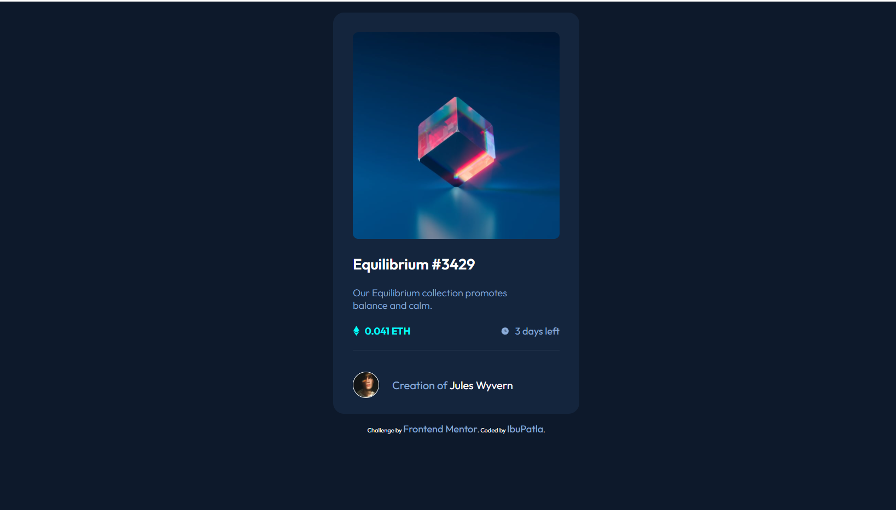

# Frontend Mentor - NFT preview card component solution

This is a solution to the [NFT preview card component challenge on Frontend Mentor](https://www.frontendmentor.io/challenges/nft-preview-card-component-SbdUL_w0U). Frontend Mentor challenges help you improve your coding skills by building realistic projects. 

## Table of contents

- [Overview](#overview)
  - [The challenge](#the-challenge)
  - [Screenshot](#screenshot)
  - [Links](#links)
- [My process](#my-process)
  - [Built with](#built-with)
  - [What I learned](#what-i-learned)
  - [Continued development](#continued-development)
  - [Useful resources](#useful-resources)
- [Author](#author)
- [Acknowledgments](#acknowledgments)

## Overview

### The challenge

Users should be able to:

- View the optimal layout depending on their device's screen size
- See hover states for interactive elements

### Screenshot

### Links

- Solution URL: [Add solution URL here](https://your-solution-url.com)
- Live Site URL: [Add live site URL here](https://ibupatla.github.io/nft-preview-card-component/)

## My process

### Built with

- HTML5 
- CSS
- Mobile-first workflow

### What I learned

Hello im a beginner front-end developer who started to do project on 2-12-2021 this was my first project i learned a lot through this project. Especially the most helpfull thing was CSS this project is based on CSS a lot there is only little html so it was a great project. Those who are begginer like me i recommend this project a lot. Thank You!
 

### Continued development

I'm going to continue doing project from 'Frontend Mentor' and after i learn front-end development intermediatly im going to do build some website to sharpen my skill's and then im going to do freelace until i complete my school after that im going to apply for jobs!

### Useful resources

- [Resource 1](https://www.google.com) - This helped me for most part of my project when ever stuck at a place i always look into google. I really liked this pattern and will use it going forward.
- [Resource 2](https://www.w3schools.com/w3css/) - This is an amazing website which helped me finally understand CSS. I'd recommend it to anyone still learning this concept.

## Author

- Website - [Ebrahim Pa aka IbuPatla](https://www.dont-have-site.com)
- Frontend Mentor - [@IbuPatla](https://www.frontendmentor.io/profile/IbuPatla)

## Acknowledgments

when i was stuck-hard at css i took a peek into the solution and if you are also stuck-hard like i was i reccomend and appreciate "https://github.com/Mattvp21/nft-preview-card-component-main" this code is not perfect but it helped me a lot to figure out things quickly. Thank You!.

